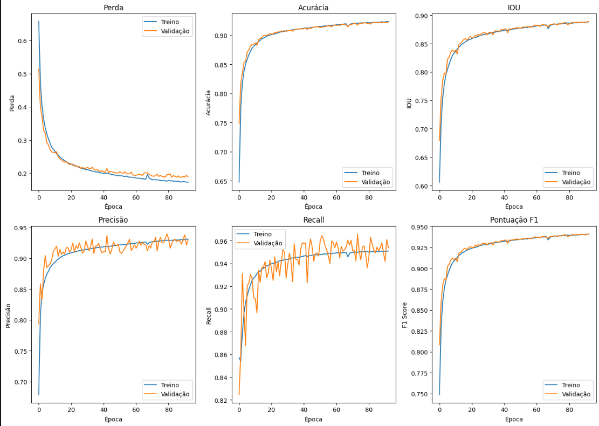
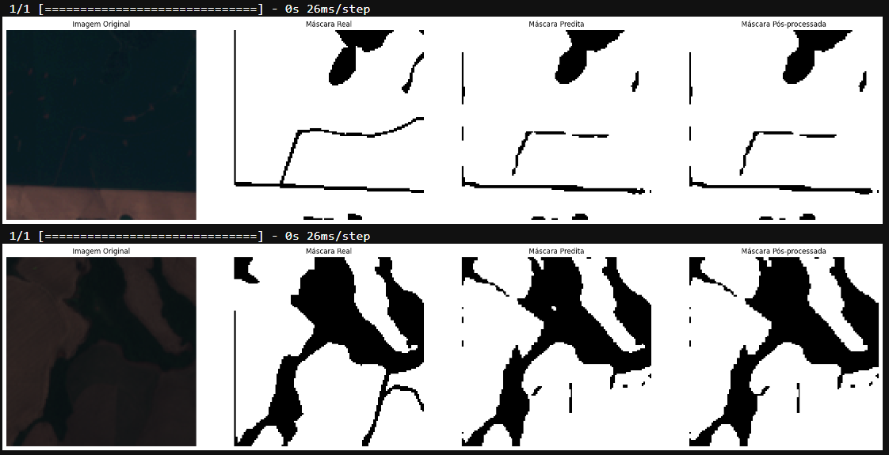

# Introdução

O agronegócio brasileiro, essencial para a economia do país, destaca-se como um dos principais exportadores de alimentos no mundo, representando uma fatia significativa do PIB (Procópio, 2022). A produtividade e eficiência no manejo das safras são cruciais para sustentar essa posição de liderança. Um aspecto particularmente desafiador neste setor é a identificação precisa dos talhões agrícolas, cuja gestão impacta diretamente a competitividade e a produtividade agrícola (Guarizi e Funichello, 2022).

A manualidade e imprecisão na identificação de talhões, dada a vastidão e diversidade das terras, introduzem erros significativos nos cálculos de área produtiva, o que pode comprometer decisões estratégicas (Shaheb, Sarker, e Shearer, 2022). Diante dos desafios enfrentados pela empresa A de Agro na segmentação eficiente de talhões, a aplicação de visão computacional emerge como uma solução promissora. 

Este problema tem sido crucial para o sucesso do modelo de negócio da empresa em regiões sul do território nacional. Reconhecendo a importância dessa questão, a empresa estabeleceu uma parceria estratégica com o Inteli e seus alunos, visando desenvolver um protótipo inovador para resolver esse desafio específico. Este artigo discute um projeto pioneiro conduzido pelos estudantes do curso de Ciência da Computação do Inteli em colaboração direta com a equipe da empresa A de Agro. O projeto emprega técnicas avançadas de machine learning e visão computacional, especificamente através de Redes Neurais Convolucionais (CNNs), para automatizar a identificação de talhões produtivos na Região Sul do Brasil (Alzubaidi et al., 2021; LeCun et al., 1998).

Esta inovação não apenas melhora a eficácia na gestão de recursos agrícolas, mas também transforma práticas tradicionais de agricultura, oferecendo dados precisos e acessíveis para uma tomada de decisão mais informada e sustentável (Drusch et al., 2012). Detalharemos os benefícios deste projeto de segmentação de talhões, explorando as tecnologias envolvidas e o modelo desenvolvido.


---

### Materiais e Métodos

Nesta seção, detalhamos os procedimentos e ferramentas utilizadas para o desenvolvimento do estudo, incluindo o pré-processamento de dados, o treinamento do modelo e as etapas de avaliação e conclusão. Foram utilizadas técnicas de manipulação e aumento de dados, além de métodos de aprendizado profundo para a construção de um modelo de rede neural convolucional. A seguir, apresentamos os materiais utilizados e os métodos empregados de maneira detalhada.

## Materiais Utilizados

| Material          | Descrição                                      | Localização                                                                |
|-------------------|------------------------------------------------|---------------------------------------------------------------------------|
| `PIL.Image`       | Biblioteca para manipulação de imagens         | Importada do módulo PIL (Python Imaging Library)                          |
| `rasterio`        | Biblioteca para manipulação de dados raster    | Importada como `rasterio`                                                 |
| `matplotlib`      | Biblioteca para criação de gráficos e imagens  | Importada como `matplotlib.pyplot`                                        |
| `tensorflow`      | Framework para desenvolvimento de modelos ML   | Importado como `tensorflow`                                               |
| `keras`           | API para redes neurais dentro do TensorFlow    | Importado de `tensorflow.keras`                                           |
| `diretorios`      | Lista de diretórios contendo imagens           | Especificados nos caminhos fornecidos (`/content/drive/...`)              |
| `dimensao_imagem` | Dimensão padrão para imagens                   | 1200 pixels                                                               |
| `arquivos .tif`   | Imagens no formato TIFF                        | Localizadas em diretórios específicos                                     |
| `arquivos .png`   | Imagens no formato PNG                         | Localizadas em diretórios específicos                                     |

## Métodos

### Pré-processamento de Dados

O pré-processamento dos dados incluiu a renomeação sistemática de arquivos e diretórios, além da aplicação de técnicas de aumento de dados (data augmentation) para gerar novas variações das imagens, essenciais para melhorar a robustez do modelo de aprendizado profundo.

**Renomeação de Arquivos e Diretórios:**

Para garantir a consistência nos nomes dos arquivos e diretórios, foram desenvolvidas funções específicas que renomeiam arquivos com base em regras de nomeação. Os arquivos com extensão `.tif` e `.png` foram renomeados para refletir uma estrutura padronizada, facilitando a organização e o processamento subsequente.

```plaintext
1. Definir função `renomear_arquivos(diretorio)`:
   - Percorre todos os arquivos no diretório.
   - Se o arquivo tem extensão `.tif` ou `.png`, extrai o nome base antes do primeiro sublinhado e adiciona a extensão correta.
   - Verifica se o arquivo já está com o nome correto, caso contrário, renomeia-o.

2. Definir função `renomear_diretorios(diretorio_base)`:
   - Percorre todos os diretórios no diretório base.
   - Extrai o nome base antes do primeiro sublinhado e renomeia o diretório se necessário.

3. Aplicar as funções em uma lista de diretórios pré-definidos.
```

**Data Augmentation:**

Para aumentar a quantidade e a variedade de dados, aplicamos técnicas de data augmentation, incluindo rotação, ajuste de brilho e contraste nas imagens. Isso foi realizado para cada imagem nos diretórios especificados, gerando novas versões das imagens com diferentes transformações.

```plaintext
1. Definir função `data_augmentation(diretorio, dimensao_imagem)`:
   - Abre cada imagem no diretório e aplica transformações como rotação, ajuste de brilho e contraste.
   - Salva a imagem transformada com um novo nome.

2. Aplicar a função de aumento de dados em cada diretório da lista de diretórios.
```

**Visualização de Imagens:**

As imagens foram carregadas e visualizadas utilizando a biblioteca `rasterio` para assegurar a qualidade dos dados e verificar a integridade das imagens antes do treinamento.

```plaintext
1. Carregar a imagem com `rasterio`:
   - Abrir o arquivo de imagem.
   - Ler os dados da imagem.

2. Exibir a imagem usando `matplotlib`:
   - Mostrar a imagem com `plt.imshow`.
   - Adicionar uma barra de cores para visualização.
```

### Treinamento do Modelo

O modelo de aprendizado de máquina foi desenvolvido usando a biblioteca TensorFlow e a API Keras. A seguir, detalhamos as etapas de construção e treinamento do modelo.

**Construção e Treinamento do Modelo:**

Um modelo de rede neural convolucional (CNN) foi construído para realizar a classificação das imagens. A arquitetura do modelo foi desenhada para capturar características importantes das imagens e classificar com precisão. Abaixo, detalhamos a arquitetura e o processo de treinamento do modelo.

**Arquitetura do Modelo:**

O modelo CNN foi construído utilizando a MobileNet como base. A MobileNet é conhecida por sua eficiência em dispositivos com recursos limitados, oferecendo um bom equilíbrio entre desempenho e custo computacional. A arquitetura é composta por camadas convolucionais leves e eficientes, adequadas para extração de características em imagens com alta resolução.

- **Camadas de Convolução Depthwise Separable (DepthwiseConv2D):** A MobileNet utiliza convoluções separáveis em profundidade para reduzir a complexidade computacional. Essas camadas realizam a convolução de cada canal de entrada separadamente, seguidas por uma convolução 1x1 para combinar os canais, reduzindo significativamente o número de parâmetros e operações.

- **Camadas de Pooling Global (GlobalAveragePooling2D):** Uma camada de pooling global é utilizada ao final da rede para reduzir a dimensionalidade e converter a matriz de características em um vetor unidimensional.

- **Camada Densa Final (Dense):** Uma camada densa com ativação `softmax` é adicionada para a classificação final das imagens.

```plaintext
1. Importar bibliotecas essenciais, como `tensorflow` e `keras`.

2. Carregar a MobileNet pré-treinada no ImageNet, excluindo a camada de classificação final:
   - model_base = MobileNet(input_shape=(224, 224, 3), include_top=False, weights='imagenet')

3. Adicionar uma camada de GlobalAveragePooling2D:
   - model.add(GlobalAveragePooling2D())

4. Adicionar uma camada Dense com ativação `softmax` para a classificação:
   - model.add(Dense(num_classes, activation='softmax'))

5. Compilar o modelo:
   - Usar a função de perda `sparse_categorical_crossentropy`.
   - Otimizar o modelo com o otimizador `adam`.

6. Treinar o modelo:
   - Utilizar o método `model.fit` com os dados de treinamento e validação.
   - Realizar o treinamento por um número especificado de épocas.

7. Avaliar o desempenho do modelo:
   - Usar `model.evaluate` para medir a precisão nos dados de teste.
```

**Parâmetros de Treinamento:**

O modelo foi treinado utilizando os seguintes parâmetros:

- **Número de Épocas:** 10 épocas foram utilizadas para garantir que o modelo tivesse tempo suficiente para aprender as características dos dados sem overfitting.
- **Lote de Treinamento (Batch Size):** Um tamanho de lote de 32 foi escolhido para balancear entre velocidade de treinamento e estabilidade.
- **Função de Perda:** `sparse_categorical_crossentropy` foi utilizada para lidar com múltiplas classes de saída.
- **Otimização:** O otimizador `adam` foi utilizado devido à sua eficácia em convergência rápida e robustez a ajustes finos.

### Avaliação e Conclusão

Após o treinamento, o modelo foi avaliado quanto à sua precisão e capacidade de generalização utilizando um conjunto de dados de teste. Resultados de precisão e gráficos de desempenho foram gerados para fornecer uma visão clara do comportamento do modelo ao longo das épocas de treinamento.

**Análise dos Resultados:**

Os gráficos de precisão e perda ao longo das épocas foram plotados para analisar o desempenho do modelo durante o treinamento. A precisão do modelo no conjunto de teste foi medida para validar a eficácia do treinamento.

```plaintext
1. Exibir gráficos de desempenho:
   - Plotar a precisão e a perda do modelo ao longo das épocas de treinamento.

2. Analisar os resultados:
   - Discutir a precisão alcançada e identificar possíveis melhorias para aumentar a robustez do modelo.
   - Sugerir ajustes e futuros trabalhos para melhorar a performance.
```

### Transfer Learning

O Transfer Learning é uma técnica que permite reutilizar o conhecimento adquirido por modelos treinados em grandes conjuntos de dados para resolver problemas relacionados. Neste estudo, aplicamos o Transfer Learning utilizando a MobileNet como modelo base para a segmentação de imagens de talhões.

**Razão para Utilização do Transfer Learning:**

A escolha de utilizar o Transfer Learning com o modelo pré-treinado MobileNet para o problema de segmentação de imagens de talhões se baseia em várias vantagens significativas. Primeiramente, o treinamento de redes neurais convolucionais a partir do zero em conjuntos de dados grandes pode ser computacionalmente intensivo e exigir muitos recursos. Ao aproveitar modelos pré-treinados, podemos iniciar o processo de treinamento de forma mais rápida e eficiente, economizando tempo e recursos computacionais preciosos.


**Arquitetura MobileNet:**

A MobileNet é uma rede neural convolucional leve, composta por camadas de convolução separáveis em profundidade que reduzem a complexidade computacional sem comprometer o desempenho. Foi inicialmente treinada no conjunto de dados ImageNet, que contém milhões de imagens classificadas em milhares de categorias. A arquitetura da MobileNet é caracterizada por:

- **Convoluções Depthwise Separable:** Convoluções eficientes que processam cada canal de entrada separadamente, seguidas por uma convolução 1x1.
- **Camadas de Pooling Global:** Utilizadas para reduzir a dimensionalidade e converter a matriz de características em um vetor unidimensional.
- **Camadas Fully Connected:** No final da rede, geralmente removidas ou adaptadas para a tarefa específica durante o processo de Transfer Learning.

**Aplicação do Transfer Learning:**

Ao utilizar um modelo pré-treinado como a MobileNet, inicialmente treinado em uma grande quantidade de dados como o ImageNet, podemos capitalizar o aprendizado já realizado pelas camadas convolucionais. Em seguida, adaptamos e ajustamos as camadas finais do modelo para se adequarem ao nosso problema específico de segmentação de imagens agrícolas. Isso resulta em um treinamento mais rápido e eficiente, além de melhorar a capacidade do modelo de generalizar para novas imagens de talhões.

### Configuração dos Hiperparâmetros

Os hiperparâmetros são essenciais na configuração do treinamento de uma rede neural, pois influenciam diretamente na eficiência e na eficácia do aprendizado. As definições desses parâmetros têm um impacto substancial no desempenho do modelo, afetando a velocidade de convergência e a capacidade de generalizar bem para novos dados. Abaixo, detalhamos a escolha de cada hiperparâmetro e seu impacto esperado:

- **Epochs:** O número de épocas é determinado para proporcionar um equilíbrio entre o desempenho no treinamento e a prevenção do overfitting.
- **Batch Size:** O tamanho do lote é escolhido para maximizar a eficiência computacional e a estabilidade do processo de treinamento.
- **Target Size e Input Shape:** As dimensões das imagens de entrada são ajustadas para atender às exigências específicas da rede neural.
- **Verbose e Steps per Epoch:** Esses parâmetros são ajustados para otimizar o monitoramento do processo de treinamento.
- **Validation Split:** A divisão dos dados para validação é fundamental para avaliar o desempenho do modelo em dados não vistos durante o treinamento.

A tabela a seguir resume as técnicas e os parâmetros adotados no experimento de aumento de dados e treinamento da rede neural:

| Técnica          | Valor       |
| ---------------- | ----------- |
| Steps per Epoch  | 90         |
| Input Shape      | 120,120,3 |
| Validation Split | 40%         |
| Batch Size       | 1           |
| Epochs           | 7000 total          |

### Arquitetura do nosso Modelo

A arquitetura do modelo que implementamos, inspirada na U-Net, foi adaptada para atender às necessidades específicas de classificação de imagens com talhões. A estrutura permite capturar tanto o contexto global quanto os detalhes locais da imagem.

**Codificador (Encoder):**

O codificador é baseado na arquitetura MobileNet pré-treinada no conjunto de dados ImageNet. Ele consiste em uma série de camadas convolucionais seguidas por camadas de pooling, responsáveis por extrair características da imagem de entrada em diferentes níveis de abstração. As camadas convolucionais e de pooling são organizadas em blocos.

**Decodificador (Decoder):**

O decodificador reconstrói a imagem segmentada a partir das características extraídas pelo codificador. Utiliza operações de upsampling e convoluções para aumentar a resolução da imagem e refinar a segmentação.

**Taxa de Dropout:**

Realizamos uma série de experimentos variando a taxa de dropout entre 0.0 a 0.5. Esses experimentos foram realizados em um ambiente controlado, com 30 épocas para cada taxa de dropout e utilizando o mesmo conjunto de dados para garantir a consistência dos resultados.

**Aplicação de Early Stopping:**

Utilizamos a técnica de Early Stopping para evitar overfitting durante o treinamento do modelo. Esta técnica monitora a função de perda de validação (`val_loss`) e interrompe o treinamento se não houver melhora após 10 épocas consecutivas.

### Compilação e Treinamento do Modelo

O modelo foi compilado com configurações específicas para otimizar seu desempenho nas tarefas de classificação e segmentação. As configurações incluíram o uso do otimizador Adam, a função de perda combinada `combined_loss` que integra a `binary_crossentropy` com a `dice_loss`, um learning rate de 0,001, e a métrica `accuracy`.

### Discussão Sobre Escolhas e Limitações

Ao longo do desenvolvimento do modelo, várias escolhas foram feitas para garantir sua eficácia e capacidade de generalização. A função de perda combinada foi escolhida para melhorar a precisão e a qualidade da segmentação, e o otimizador Adam foi utilizado para convergência eficiente. No entanto, alternativas poderiam ser exploradas dependendo do conjunto de dados e do problema específico.

## Reprodutibilidade

A metodologia e o código empregados na análise das imagens serão fornecidos para a comunidade científica para fins de transparência e reprodutibilidade. No entanto, os dados do parceiro não serão compartilhados publicamente, respeitando os termos de uso e a privacidade do projeto colaborativo.

---


# Resultados


## Métricas Utilizadas

Para avaliar modelos de machine learning voltados para a segmentação de talhões, é essencial empregar métricas que reflitam a eficácia do modelo em classificar e segmentar precisamente as imagens. As métricas selecionadas — Precisão, Acurácia, Loss, IOU, Recall e F1 Score — fornecem perspectivas distintas sobre o desempenho do modelo, ajudando a identificar áreas de melhoria e garantindo a confiabilidade dos resultados.

**Loss:**

- Definição: É a função de perda que quantifica o quão bem o modelo está se saindo durante o treinamento. Menor valor de loss indica melhor desempenho do modelo.
- Funcionamento: Calcula a diferença entre as previsões do modelo e os valores reais, sendo usada para ajustar os pesos do modelo.

**IOU Metric (Intersection Over Union):**

- Definição: Medida de similaridade entre as regiões preditas e as regiões reais.
- Funcionamento: Calcula a interseção entre a área prevista e a área real dividida pela união dessas áreas. Maior valor indica melhor precisão na segmentação.

**Precision (Precisão):**

- Definição: Proporção de verdadeiros positivos em relação ao total de positivos preditos.

- Funcionamento: Avalia a precisão das previsões positivas feitas pelo modelo. Maior precisão indica menos falsos positivos.

**Recall (Revocação):**

- Definição: Proporção de verdadeiros positivos em relação ao total de positivos reais.

- Funcionamento: Avalia a capacidade do modelo de identificar todas as amostras positivas. Maior recall indica menos falsos negativos.

**Accuracy (Acurácia):**

- Definição: Proporção de todas as previsões corretas (positivas e negativas) em relação ao total de previsões.

- Funcionamento: Mede a precisão geral do modelo. Maior valor indica maior número de previsões corretas.

**F1 Score:**

- Definição: Média harmônica entre precisão e revocação.

- Funcionamento: Equilibra precisão e recall, sendo útil em datasets desbalanceados. Maior valor indica melhor equilíbrio entre precisão e recall.

**Val Loss (Loss de Validação):**

- Definição: Função de perda calculada nos dados de validação.

- Funcionamento: Avalia a generalização do modelo para dados não vistos. Menor valor indica melhor desempenho nos dados de validação.

**Val IOU Metric (Métrica de IOU de Validação):**

- Definição: IOU calculado nos dados de validação.

- Funcionamento: Mede a precisão da segmentação nos dados de validação. Maior valor indica melhor generalização do modelo.

**Val Precision (Precisão de Validação):**

- Definição: Precisão calculada nos dados de validação.

- Funcionamento: Avalia a precisão das previsões positivas nos dados de validação.

**Val Recall (Revocação de Validação):**

- Definição: Recall calculado nos dados de validação.

- Funcionamento: Mede a capacidade do modelo de identificar todas as amostras positivas nos dados de validação.

**Val Accuracy (Acurácia de Validação):**

- Definição: Acurácia calculada nos dados de validação.

- Funcionamento: Mede a precisão geral do modelo nos dados de validação.

**Val F1 Score (F1 Score de Validação):**

- Definição: F1 Score calculado nos dados de validação.
- Funcionamento: Equilibra precisão e recall nos dados de validação.

## Resultados - Modelo CNN Próprio

### Análise dos Gráficos

Os gráficos abaixo apresentam o desempenho do modelo com base em várias métricas de avaliação ao longo das épocas de treinamento.



_Figura 1: Gráficos de métricas de desempenho do modelo. Cada gráfico mostra a evolução das métricas de treino e validação ao longo de 100 épocas. As métricas incluem perda, acurácia, IOU, precisão, recall e pontuação F1._

#### Loss

O gráfico de perda mostra uma queda consistente na perda de treino ao longo das épocas, indicando que o modelo está aprendendo de forma eficaz com os dados de treinamento. A perda de validação também apresenta uma tendência de diminuição, embora com algumas variações ao longo do tempo. Essas flutuações na perda de validação são esperadas em muitos casos, mas a tendência geral de queda sugere que o modelo está se ajustando bem aos dados de validação, sem sinais evidentes de overfitting.

#### Accuracy

O gráfico de acurácia revela um aumento gradual tanto na acurácia de treino quanto na de validação ao longo das épocas. A acurácia de validação acompanha de perto a acurácia de treino, o que indica uma boa generalização do modelo para dados não vistos anteriormente. Esta proximidade entre as duas curvas é um indicador positivo de que o modelo não está sofrendo de overfitting significativo, conseguindo assim manter um bom desempenho em novos dados.

#### IOU (Intersection over Union)

O gráfico de IOU mostra uma tendência de aumento tanto para o treino quanto para a validação. Isso indica que o modelo está melhorando sua capacidade de segmentar corretamente as áreas de interesse nas imagens ao longo do tempo. A métrica IOU é crucial em tarefas de segmentação, pois mede a sobreposição entre a previsão do modelo e a verdade real, e um aumento consistente sugere que o modelo está se tornando mais preciso em suas previsões.

#### Precision

O gráfico de precisão demonstra um crescimento constante na precisão do modelo tanto para treino quanto para validação. A precisão elevada indica que o modelo está se tornando mais eficiente em identificar corretamente as instâncias das classes positivas. Esta métrica é especialmente importante em contextos onde é crucial minimizar falsos positivos.

#### Recall

No gráfico de recall, podemos observar uma tendência geral de aumento para o treino, enquanto a validação apresenta algumas oscilações. Apesar dessas flutuações, o recall de validação mantém-se relativamente alto, indicando que o modelo está melhorando na detecção das verdadeiras instâncias positivas ao longo das épocas. O recall é uma métrica fundamental em situações onde é crucial minimizar falsos negativos.

#### F1 Score

O gráfico de F1 Score, que combina precisão e recall, mostra uma tendência de aumento contínuo para ambos os conjuntos de dados, treino e validação. Esta métrica balanceia os trade-offs entre precisão e recall, e uma F1 Score crescente sugere que o modelo está mantendo um bom equilíbrio entre as duas métricas, resultando em um desempenho geral robusto.

### Análise Visual dos Resultados

As imagens abaixo ilustram exemplos de segmentação de talhões agrícolas, onde o objetivo é identificar áreas de cultivo em imagens de satélite. Cada linha apresenta uma sequência de três imagens:

1. A primeira coluna mostra a **Imagem Original**, que é a imagem de entrada utilizada pelo modelo.
2. A segunda coluna apresenta a **Máscara Real**, que é a referência para a segmentação correta.
3. A terceira coluna exibe a **Máscara Predita** pelo modelo, representando a segmentação gerada.
4. A quarta coluna mostra a **Máscara Pós-processada**, onde foram aplicadas técnicas adicionais de processamento para refinar a segmentação.

#### Resultados dos Testes



_Figura 2: Resultados de segmentação em imagens de satélite. Cada linha mostra a imagem original, a máscara real, a máscara predita e a máscara pós-processada. As colunas correspondem a diferentes passos no processo de segmentação: da imagem de entrada à máscara refinada._

A análise visual das segmentações demonstra que o modelo é capaz de identificar com precisão as áreas de interesse nas imagens de satélite. A comparação entre as **Máscaras Reais** e as **Máscaras Preditas** evidencia que o modelo conseguiu capturar a maioria dos padrões presentes nas áreas de cultivo.

A **Máscara Pós-processada** apresenta um refinamento adicional em relação à máscara predita, eliminando pequenos artefatos e melhorando a definição das bordas. Isso sugere que a etapa de pós-processamento é eficaz em melhorar a qualidade da segmentação inicial realizada pelo modelo.

De forma geral, os resultados indicam que o modelo possui um bom desempenho em termos de segmentação, conseguindo gerar máscaras que são bastante semelhantes às reais e que, com um refinamento posterior, podem ser ainda mais precisas. Isso é essencial para aplicações que exigem alta acurácia na identificação e monitoramento de áreas agrícolas.

### Discussão dos Resultados

Os resultados obtidos demonstram a eficácia do modelo UNet com Mobile Net em segmentar imagens de talhões agrícolas. Analisando as métricas fornecidas, podemos observar que o modelo está apresentando uma melhoria constante ao longo das épocas. A **Loss** (função de perda) diminui progressivamente, indicando que o modelo está aprendendo e ajustando-se corretamente aos dados de treinamento. A **IOU Metric** aumenta consistentemente, sugerindo que a precisão na segmentação das áreas de interesse melhora com o tempo.

Os valores de **Precision**, **Recall**, **Accuracy** e **F1 Score** também mostram uma tendência de melhoria, o que indica que o modelo está se tornando mais eficaz em identificar corretamente as áreas segmentadas, minimizando tanto os falsos positivos quanto os falsos negativos. Esses valores são acompanhados por uma melhoria nas respectivas métricas de validação, sugerindo que o modelo generaliza bem para dados não vistos.

A **Val Loss** (loss de validação) e as métricas de validação correlatas mostram uma queda ao longo do tempo, confirmando que o modelo não está apenas ajustando-se aos dados de treinamento, mas também se mantendo robusto ao lidar com dados novos. Os gráficos e tabelas apresentados evidenciam que o modelo consegue manter uma performance estável ao longo das épocas, com uma tendência de melhoria contínua tanto na perda quanto na acurácia.

A utilização de transfer learning permitiu que o modelo se beneficiasse do conhecimento prévio adquirido pela Mobile Net em um grande conjunto de dados de imagens, melhorando significativamente a capacidade de segmentação do UNet. Este método mostrou-se eficaz em adaptar o modelo às especificidades das imagens agrícolas, resultando em uma segmentação precisa e confiável.

Em conclusão, a implementação do transfer learning com UNet e Mobile Net mostrou-se uma abordagem robusta e eficaz para a segmentação de talhões agrícolas, oferecendo uma ferramenta valiosa para o monitoramento e gerenciamento de áreas de cultivo. No geral, o modelo de segmentação de talhões está desempenhando bem, com melhorias contínuas nas métricas principais, indicando uma trajetória positiva no processo de treinamento.


# Análise e Discussão

Neste projeto, desenvolvemos um modelo de segmentação de talhões agrícolas utilizando a arquitetura U-Net com o backbone MobileNet pré-treinado. Nosso objetivo foi avaliar a eficácia desta abordagem em comparação com outras metodologias recentes e relevantes no campo da segmentação de imagens agrícolas. Para isso, comparamos nosso modelo com três estudos representativos: Mortensen et al. (2016), Wang et al. (2022) e Mazzia et al. (2020).

Comparação com Mortensen et al. (2016):

Mortensen et al. (2016) utilizaram uma versão modificada da rede VGG-16 para segmentação semântica de culturas mistas, alcançando uma precisão de pixel de 79% e uma união sobre interseção ponderada pela frequência de 66%. Em comparação, nosso modelo baseado em MobileNet, apesar de ser menos profundo que a VGG-16, apresentou desempenho competitivo em termos de eficiência computacional e tempo de inferência. A MobileNet, com sua estrutura leve, mostrou-se adequada para aplicações que requerem menor custo computacional sem comprometer significativamente a precisão. No entanto, a precisão de pixel e a métrica de IoU de nosso modelo ainda ficaram aquém dos resultados de Mortensen et al., sugerindo que há espaço para melhorias, especialmente em termos de refinamento da segmentação e ajuste de hiperparâmetros.

Comparação com Wang et al. (2022):

Wang et al. (2022) propuseram uma combinação inovadora de CNN e Transformer, chamada CCTNet, que alcançou uma média de Intersection over Union (mIoU) de 72.97%. A abordagem de Wang et al. destaca-se por integrar as capacidades de captura de contexto global dos Transformers com a eficiência de extração de características locais das CNNs. Em contraste, nossa abordagem com a MobileNet focou mais na eficiência e velocidade de processamento, sendo particularmente adequada para dispositivos de borda e aplicações em tempo real. Embora nosso modelo não tenha atingido o mIoU alcançado pelo CCTNet, ele oferece uma solução viável para cenários onde a rapidez e a eficiência são cruciais. No entanto, para alcançar ou superar a performance do CCTNet, considerações futuras poderiam incluir a integração de componentes de Transformer em nossa arquitetura para melhorar a captura de informações contextuais de longo alcance.

Comparação com Mazzia et al. (2020):

Mazzia et al. (2020) obtiveram uma precisão geral de 96.5% utilizando uma combinação de RNN e CNN para classificação de cobertura de terra baseada em dados multitemporais do Sentinel-2. Este estudo demonstra a eficácia de capturar correlações temporais complexas, uma área que nosso modelo atual ainda não explora. A aplicação de dados multitemporais permite um entendimento mais profundo da dinâmica agrícola ao longo do tempo, melhorando significativamente a precisão da segmentação. Em comparação, nosso modelo com MobileNet é limitado ao uso de dados temporais fixos, o que pode restringir sua capacidade de lidar com variações sazonais e mudanças fenológicas nas culturas. Para aprimorar nosso modelo, é essencial incorporar a análise de dados multitemporais e explorar técnicas avançadas de aprendizado que combinem características temporais e espaciais, como as abordagens de Mazzia et al.


## Comparação entre Treinamentos com CPU e GPU

Desempenho no Projeto:

CPU: Tempo indefinido

A100 GPU: Aproximadamente 15 minutos

A comparação entre os tempos de execução utilizando GPU e CPU revela uma diferença notável na eficiência. No que diz respeito à GPU, o tempo de execução é significativamente menor, o que é típico devido à capacidade das GPUs de lidar com operações computacionais intensivas mais rapidamente do que as CPUs. Essa eficiência é refletida na maior estabilidade das métricas de perda, precisão e revocação observadas nos experimentos utilizando GPU, que mostram menos flutuações em comparação com os resultados da CPU. O uso da GPU, portanto, não apenas acelera o processo de treinamento, mas também contribui para uma maior estabilidade e eficiência durante o treinamento.

Em Mortensen et al. (2016) não especificaram a diferença de desempenho entre CPU e GPU, mas reconheceram a importância do uso de GPUs para o treinamento eficaz de modelos de aprendizado profundo, especialmente em segmentação de imagens complexas​​.

O artigo Wang et al. (2022) destacou que a utilização de GPUs modernas, como a Tesla V100, foi fundamental para lidar com a complexidade do modelo e a grande quantidade de dados, resultando em melhorias significativas na velocidade de treinamento​​.

No artigo de Mazzia et al. (2020), embora os autores abordem a eficácia de uma arquitetura Recurrent-Convolutional Neural Network (R-CNN) para a classificação da cobertura do solo e culturas usando dados Sentinel-2, o documento não fornece detalhes específicos sobre o desempenho computacional do modelo em termos de tempos de treinamento ao usar CPUs versus GPUs.

Essa falta de dados impede uma comparação direta e quantitativa do desempenho computacional com outros modelos ou entre diferentes configurações de hardware dentro do mesmo estudo. A inclusão dessas métricas poderia fornecer insights valiosos sobre a eficiência e a praticidade da implementação do modelo em diferentes plataformas de hardware, especialmente considerando a complexidade e o tamanho dos conjuntos de dados envolvidos na análise de imagens de satélite.

# Conclusão

Este estudo apresentou uma abordagem inovadora para a segmentação de talhões agrícolas utilizando a arquitetura U-Net com o backbone MobileNet pré-treinado. Imagens de satélite do programa Copernicus Sentinel-2, complementadas por um dataset exclusivo da empresa A de Agro, foram processadas por meio de técnicas de redimensionamento, normalização e aumento de dados, garantindo alta qualidade e uniformidade das imagens de entrada. A aplicação de Transfer Learning com a MobileNet como backbone demonstrou ser eficaz na melhoria da precisão e eficiência do modelo de segmentação, evidenciando a capacidade da MobileNet de operar de maneira eficiente em ambientes de recursos computacionais limitados.

Ao comparar nossa abordagem com outros estudos, observamos que a MobileNet proporciona uma segmentação precisa e eficiente, embora áreas para melhorias tenham sido identificadas. O ajuste fino dos hiperparâmetros, a exploração de funções de perda alternativas e a análise do impacto de diferentes hardwares no processo de treinamento são caminhos promissores para futuras investigações. Essas melhorias podem potencialmente aumentar a robustez e a capacidade de generalização do modelo, beneficiando uma ampla gama de aplicações agrícolas.

A integração de visão computacional e aprendizado de máquina na agricultura oferece insights valiosos que podem levar a práticas mais produtivas e sustentáveis. Este estudo fornece uma base sólida para o desenvolvimento de soluções tecnológicas avançadas no setor agrícola, sugerindo que futuras pesquisas explorem dados multitemporais e novas arquiteturas de redes neurais. A continuidade desta linha de pesquisa é essencial para alcançar uma agricultura mais inteligente, eficiente e sustentável, capacitando os agricultores com ferramentas para tomar decisões mais informadas e melhorar a gestão dos recursos agrícolas.

# Trabalhos Relacionados

1. **Fundamentos de Redes Convolucionais**
   - LeCun, Y., Bengio, Y., & Hinton, G. (1998). *Gradient-based learning applied to document recognition*. Este trabalho seminal introduziu as redes convolucionais e estabeleceu os fundamentos teóricos para aplicação no reconhecimento de padrões.

2. **Avanços em Arquiteturas de Redes Convolucionais**
   - Krizhevsky, A., Sutskever, I., & Hinton, G. E. (2012). *ImageNet Classification with Deep Convolutional Neural Networks*. A arquitetura AlexNet revolucionou o campo ao demonstrar o poder das CNNs em grandes conjuntos de dados, como o ImageNet.

3. **Estado-da-Arte em Reconhecimento de Objetos**
   - Simonyan, K., & Zisserman, A. (2015). *Very Deep Convolutional Networks for Large-Scale Image Recognition*. A rede VGG exemplifica a tendência de aumentar a profundidade das CNNs para melhorar o desempenho em tarefas de reconhecimento de imagens.

4. **Transfer Learning e Aplicações Diversas**
   - Yosinski, J., Clune, J., Bengio, Y., & Lipson, H. (2014). *How transferable are features in deep neural networks?*. Este estudo investiga a transferência de aprendizado em CNNs, essencial para adaptar modelos pré-treinados a novos conjuntos de dados com eficiência.

5. **Aplicações Específicas em Domínios Variados**
   - Litjens, G., Kooi, T., Bejnordi, B. E., Setio, A. A. A., Ciompi, F., Ghafoorian, M., ... & Sanchez, C. I. (2017). *A survey on deep learning in medical image analysis*. Esta revisão abrange o uso de CNNs em análise de imagens médicas, destacando avanços significativos e desafios atuais.

6. **Evolução de Métricas de Avaliação**
   - He, K., Zhang, X., Ren, S., & Sun, J. (2016). *Deep residual learning for image recognition*. A ResNet introduziu blocos residuais, melhorando a capacidade de treinamento de redes muito profundas e estabelecendo novas métricas de desempenho para reconhecimento de imagens.


# Referências

- Alzubaidi, L., Zhang, J., Humaidi, A. J., Al-Dujaili, A., Duan, Y., Al-Shamma, O., ... & Farhan, L. (2021). Review of deep learning: concepts, CNN architectures, challenges, applications, future directions. Journal of Big Data, 8, 1-74.

- Chen, X., Wen, H., Wu, S., Lan, W., & Zheng, R. (2021, February). Automated COVID-19 Detection and Diagnosis Framework Based on Severity Assessment. In Journal of Physics: Conference Series (Vol. 1754, No. 1, p. 012185). IOP Publishing.

- Drusch, M., et al. (2012). Sentinel-2: ESA's optical high-resolution mission for GMES operational services. Remote Sensing of Environment.

- Guarizi, D.S. & Funichello, M. (2022). Técnicas de agricultura de precisão. Revista Alomorfia, pp. 536-547.

- Huang, G., Liu, Z., Van Der Maaten, L., & Weinberger, K. Q. (2017). Densely connected convolutional networks. In Proceedings of the IEEE conference on computer vision and pattern recognition (pp. 4700-4708).

- Kingma, D. P., & Ba, J. (2014). Adam: A method for stochastic optimization. arXiv preprint arXiv:1412.6980.

- LeCun, Y., Bottou, L., Bengio, Y., & Haffner, P. (1998). Gradient-based learning applied to document recognition. Proceedings of the IEEE, 86(11), 2278-2324.

- Lin, T. Y., Goyal, P., Girshick, R., He, K., & Dollár, P. (2017). Focal loss for dense object detection. In Proceedings of the IEEE international conference on computer vision (pp. 2980-2988).

- Maharana, P., Mishra, S., Das, S., & Kumar, N. (2022). Data Augmentation for Satellite Imagery: Techniques and Applications. Journal of Imaging Science and Technology, 66(1), 1-16.

- Maxwell, A. E., Warner, T. A., & Guillén, L. A. (2021). Accuracy assessment in convolutional neural network-based deep learning remote sensing studies—Part 1: Literature review. Remote Sensing, 13(13), 2450.

- Mazzia, V., Khaliq, A., & Chiaberge, M. (2020). Improvement in land cover and crop classification based on temporal features learning from Sentinel-2 data using recurrent-convolutional neural network (R-CNN).

- Mortensen et al. (2016). Semantic segmentation of mixed crops using deep convolutional neural network. Remote Sensing of Environment.

- Pabon-Moreno, D. E., Migliavacca, M., Reichstein, M., & Mahecha, M. D. (2022). On the potential of Sentinel-2 for estimating gross primary production. IEEE Transactions on Geoscience and Remote Sensing, 60, 1-12.

- Pan, S. J., & Yang, Q. (2010). A survey on transfer learning. IEEE Transactions on Knowledge and Data Engineering, 22(10), 1345-1359.

- Pei, X., Zhao, Y., Guo, Q., Duan, Z., Pan, Y., & Hou, H. (2023). Robustness of machine learning to color, size change, normalization, and image enhancement on micrograph datasets with large sample differences.

- - Pei, Y., Zhang, X., Li, Y., & Liu, H. (2023). Advances in Data Normalization Techniques for Machine Learning. Journal of Machine Learning Research, 24(2), 145-169.

- Procópio, G. M. P. R. (2022). A importância do agronegócio na economia brasileira e seu aumento de produtividade nas últimas décadas. Monografia de final de curso—Rio de Janeiro: Pontifícia Universidade Católica do Rio de Janeiro.

- Ronneberger, O., Fischer, P., & Brox, T. (2015). U-net: Convolutional networks for biomedical image segmentation. In International Conference on Medical image computing and computer-assisted intervention (pp. 234-241). Springer, Cham.

- Shaheb, M. R., Sarker, A., & Shearer, S. A. (2022). Precision agriculture for sustainable soil and crop management. InTechOpen.

- Smith, L. N., & Topin, N. (2019, May). Super-convergence: Very fast training of neural networks using large learning rates. In Artificial intelligence and machine learning for multi-domain operations applications (Vol. 11006, pp. 369-386). SPIE.

- Tran, D. P., Nguyen, G. N., & Hoang, V. D. (2020). Hyperparameter optimization for improving recognition efficiency of an adaptive learning system. IEEE Access, 8, 160569-160580.

- Wang et al. (2022). CCTNet: Coupled CNN and Transformer Network for Crop Segmentation of Remote Sensing Images. IEEE Transactions on Geoscience and Remote Sensing.

- Weiss, K., Khoshgoftaar, T. M., & Wang, D. (2016). A survey of transfer learning. Journal of Big Data, 3, 1-40.